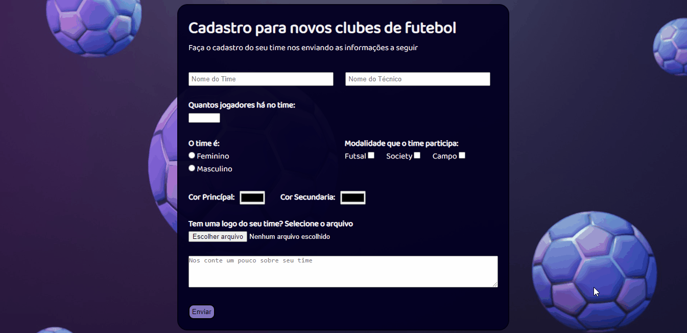

# Projeto Pessoal Formulário

Meu primeiro projeto pessoal onde fiz sozinho do começo ao fim. Meu maior desafio foi na estilização usando o CSS, principalmente para alinhar as caixas em coluna e dar espaçamentos. Sinto que meu código não está muito limpo mas por ser meu primeiro projeto estou muito satisfeito com o resultado.

## Tecnologias Usadas

* HTML
* CSS

